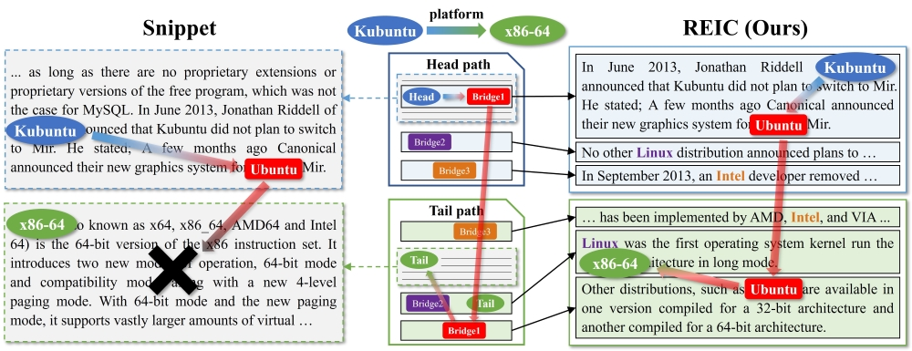

# REIC: Reward-based Input Construction for Cross-document Relation Extraction (ACL 2024)

| [paper](https://arxiv.org/abs/2405.20649) | [checkpoints](https://www.dropbox.com/scl/fo/v3k13ebovyzay1bf18d8l/ACfssGM-7KHDRoA7-QRjUy0?rlkey=9rae8pfqasahtcm9020z2tba0&dl=0) |

--------------------

This repo contains an official PyTorch implementation for the paper "Reward-based Input Construction for Cross-document Relation Extraction" in [ACL 2024](https://2024.aclweb.org/) main conference.

**[Byeonghu Na](https://sites.google.com/view/byeonghu-na)\*, [Suhyeon Jo](https://aai.kaist.ac.kr/bbs/board.php?bo_table=sub2_1&wr_id=10)\*, [Yeongmin Kim](https://sites.google.com/view/yeongmin-space), and [Il-Chul Moon](https://aai.kaist.ac.kr/bbs/board.php?bo_table=sub2_1&wr_id=3)**   
<sup> * Equal contribution </sup>

--------------------

This paper proposes **REward-based Input Construction (REIC)**, the first learning-based sentence selector for cross-document relation extraction.




## Data Preparation and Processing

For data preparation and processing steps, please follow the instructions provided in the [CodRED repository](https://github.com/thunlp/CodRED).

## Usage

To train and evaluate the model, you have two options: end-to-end + REIC or ECRIM + REIC. The details for each option are provided below.

### Backbone: BERT

### Option 1: End-to-End + REIC

To train and evaluate the model using the end-to-end + REIC method, run the following command:

```bash
cd codred-reic
python codred-reic.py --train --dev --per_gpu_train_batch_size 4 --per_gpu_eval_batch_size 1 --num_workers 0 --logging_step 10 --epochs 2 --num_sentences 6 --selector_learning_rate 3e-3
```

### Option 2: ECRIM + REIC
This option requires saving sentence embeddings first to reduce embedding time. Follow these steps:

1. Save sentence embeddings:

```bash
cd ecrim-reic
python main_save.py --train --senemb_path ../../../data/senemb_ecrim
python main_save.py --dev --senemb_path ../../../data/senemb_ecrim
python main_save.py --test --senemb_path ../../../data/senemb_ecrim

```

2. Run the training and evaluation:

```bash
python main_reic.py --train --dev --per_gpu_train_batch_size 4 --per_gpu_eval_batch_size 1 --num_workers 0 --logging_step 10 --epochs 10 --num_sentences 14 --selector_learning_rate 3e-3 --learning_rate 3e-5 --gradient_accumulation_steps 4 --save_steps 1000000 --lam_none 1 --epsilon 0.2
```

The command includes the following arguments:

- `--train`: Flag to indicate training mode.
- `--dev`: Flag to indicate development mode.
- `--per_gpu_train_batch_size`: Batch size per GPU during training.
- `--per_gpu_eval_batch_size`: Batch size per GPU during evaluation.
- `--num_workers`: Number of workers for data loading.
- `--logging_step`: Interval for logging training progress.
- `--epochs`: Number of training epochs.
- `--num_sentences`: Number of sentences to consider for each input.
- `--selector_learning_rate`: Learning rate for the selector module.
- `--gradient_accumulation_steps`: Number of steps to accumulate gradients before updating.
- `--save_steps`: Interval for saving the model.
- `--lam_none`: Lambda parameter for none class regularization.
- `--epsilon`: Epsilon parameter for exploration.

Please adjust the arguments as needed based on your specific setup and requirements.


## Acknowledgements

This work is heavily built upon the code from:
* [[CodRED]](https://github.com/thunlp/CodRED) Yuan Yao, Jiaju Du, Yankai Lin, Peng Li, Zhiyuan Liu, Jie Zhou, and Maosong Sun. 2021. *CodRED: A Cross-Document Relation Extraction Dataset for Acquiring Knowledge in the Wild.* In Proceedings of the 2021 Conference on Empirical Methods in Natural Language Processing, pages 4452–4472, Online and Punta Cana, Dominican Republic. Association for Computational Linguistics.
* [[ECRIM]](https://github.com/MakiseKuurisu/ecrim) Fengqi Wang, Fei Li, Hao Fei, Jingye Li, Shengqiong Wu, Fangfang Su, Wenxuan Shi, Donghong Ji, and Bo Cai. 2022. *Entity-centered Cross-document Relation Extraction.* In Proceedings of the 2022 Conference on Empirical Methods in Natural Language Processing, pages 9871–9881, Abu Dhabi, United Arab Emirates. Association for Computational Linguistics.


## Citation

```
@article{na2024reward,
  title={Reward-based Input Construction for Cross-document Relation Extraction},
  author={Na, Byeonghu and Jo, Suhyeon and Kim, Yeongmin and Moon, Il-Chul},
  journal={arXiv preprint arXiv:2405.20649},
  year={2024}
}
```
